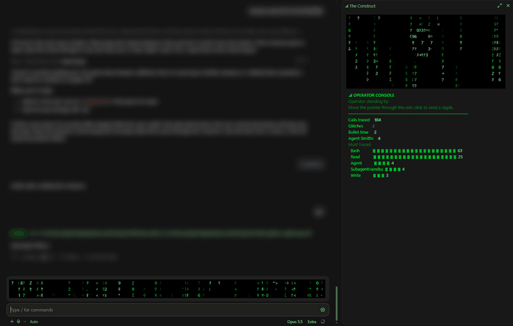

# matrix-skin

A Matrix look for Claude Code.



- Each session opens with a jack-in sequence in the band: the film's opening
  lines type out ("Call trans opt: received."), a bar fills, then the rain
  starts. A phone line dials and a modem screeches while it runs.
- Every message you send arrives as glyph noise in its own shape. Then each
  letter burns white and locks in, in a sweep from left to right (about two
  seconds). Claude's replies decode the same way inside their normal
  formatting, so nothing jumps when they finish.
- Green code rain falls in a band above the prompt. While Claude works it
  pours, with white-hot heads, fading trails and flickering glyphs. While idle
  it drizzles, and "Wake up, Neo...", "The Matrix has you..." and friends type
  themselves into it. In the desktop app, move the pointer through the rain to
  part it, and click to send a ring of light through it.
- While a tool runs, the status line reads "◢ tracing Bash ｱﾂ" and the band
  shows "◢ TRACE  Bash". A tool that runs past four seconds drops the band
  into bullet time: the rain crawls and the spinner says "Dodging bullets".
- When a tool fails, the Matrix glitches: for a couple of seconds the rain
  turns red and "Déjà vu." shudders in the band, and a Sentinel (a head of red
  eyes trailing tentacles) swims across the rain.
- When the same call fails again and again, that is a real déjà vu. Its trace
  line glitches, the Construct's status reads `DÉJÀ VU  Bash npm test ×3`, and
  on the third failure a toast says Claude is going in circles.
- Tool rows read as green trace lines: `◢ Bash › npm test`, red when a call
  failed. Rows whose body matters (edits, checklists, questions) keep their
  normal look.
- Subagents are Agent Smiths. When one deploys, the band announces him and
  the rain replicates him for a few seconds, over a low stab of sound. Switch
  on his voice for a "Mister Anderson." now and then. His spinner shows his name, and his
  tool calls show as `SMITH › Bash`.
- After each turn the status line says how it went ("◢ Jacked out after
  12s"). Then the Operator radios in a one-line report that a small model writes.
- `/construct` opens the Construct: a pane that is all rain, with the
  operator's readout decoding inside it. When a line changes, only the changed
  characters decode again. The readout fits the pane's height; when the pane
  is short, the least important blocks give way first. It shows:
  - **Status and counters**: what the operator sees now, and the session's
    calls, glitches, bullet times and Smiths.
  - **Zion**: the git state of the working folder, such as
    `ZION  main ↑2 · 3 changed`, read again after each call that can change it.
  - **Life in the Matrix**: totals across every session: time Claude spent
    working, calls, sessions and Smiths.
  - **The Oracle**: click `[ORACLE]` and a small model reads the trace log and
    gives a one-line prophecy about how the work is going.
  - **Trace log**: one line per tool call (time, ✓ or ✖, duration, what ran).
    In the desktop app, click a line to open it: the full command and the last
    lines of its output. Click it again to close it.
  - **The Keymaker**: the files Claude opened most, with read and edit counts
    (`R3  E4   src/auth.ts`).
  - **Agent Smiths**: each running subagent's task, time in the Matrix and calls.
  - **Controls**: click `[SOUND ●]`, `[ORACLE]`, `[BLUE PILL]` and the rest. In
    the terminal, press its number.
- The footer's mode labels gain "◢ matrix" while the look is on.

## Commands

| Command | What it does |
| --- | --- |
| `/matrix` | Offers the red pill (on) and the blue pill (off) in the band above the prompt: click, or press 1 or 2 |
| `/matrix red`, `/matrix blue` | Choose at once |
| `/matrix morpheus [on\|off]` | Claude answers in the voice of Morpheus (off by default) |
| `/matrix operator [on\|off]` | The Operator's one-line report after each turn (on by default; one small model call per turn) |
| `/matrix rows [on\|off]` | Tool rows as green trace lines (on by default) |
| `/matrix sound [on\|off]` | Sound for the jack-in and Agent Smith (on by default) |
| `/matrix voice [on\|off]` | "Mister Anderson." when an Agent Smith deploys (off by default; needs sound on) |
| `/matrix help` | Lists these |
| `/construct` | Opens the operator console (each `[ORACLE]` click is one small model call) |

The plugin remembers every choice, and the lifetime totals, across sessions.
Zion runs `git status` in the session's folder; outside a repository it reads
"offline".

## Install

In Claude Code (terminal or the desktop app's Code tab):

```
/plugin marketplace add FactionRed/matrix-skin
/plugin install matrix-skin@matrix-skin
```

Then start a new session, or reload plugins. Type `/matrix` to choose your pill.

It needs a recent Claude Code with plugin hook modules (built and tested on
2.1.289). To try it from a clone without installing:
`claude --plugin-dir /path/to/matrix-skin`

macOS plays the sounds and the voice through Claude Code's own player. On
Windows, which Claude Code has no player for, the plugin plays them with
Windows' built-in SoundPlayer and voice, through PowerShell. A Linux terminal
stays silent. Every sound is
synthesized by `tools/make_sounds.py`, so the plugin ships no recorded audio.

The code rain is drawn in the terminal and in the desktop app; the editor
extensions and mobile get the decoding messages and the rest.

Tune it: colors, speeds and glyphs are constants at the top of
`hooks/register.tsx` and `hooks/rain-core.ts`. DECODE_FRAMES sets how long a
message takes to decode. BULLET_FRAMES sets how long a tool runs before bullet
time. PHRASES sets what types into the rain, and TRAIL sets the trail's colors.

## License

Copyright (c) 2026 DoomLord. All rights reserved. You may install and use the
plugin; no license is granted to copy, modify or redistribute its source.
